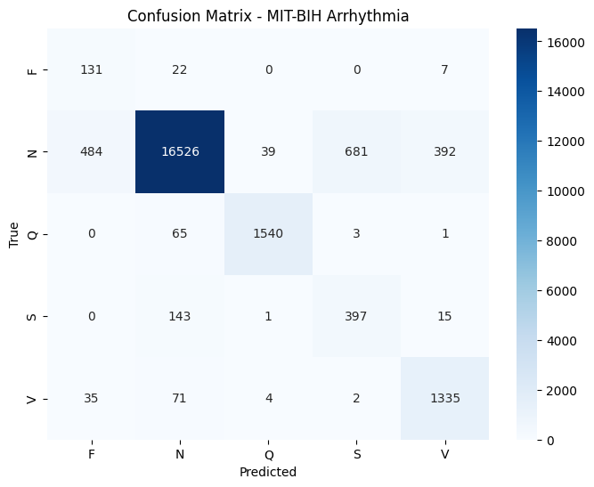

# CardioVision AI – Deep Learning for ECG Arrhythmia Classification

[](https://opensource.org/licenses/MIT)
[](https://colab.research.google.com/github/yourusername/ecg-arrhythmia-ai/blob/main/CardioVision_ECG_Classifier.ipynb)

A clinically interpretable deep learning model that classifies individual heartbeats from ECG signals into **5 AAMI arrhythmia categories** (Normal, Supraventricular, Ventricular, Fusion, Paced).  
Achieves **91.02% test accuracy** on the MIT‑BIH Arrhythmia Database.

---

## 📌 Table of Contents
- [Overview](#overview)
- [Key Features](#key-features)
- [Results](#results)
- [Explainability (Grad‑CAM)](#explainability-grad-cam)
- [Repository Structure](#repository-structure)
- [Installation & Usage](#installation--usage)
- [License](#license)
- [Acknowledgments](#acknowledgments)

---

## 🔍 Overview

Cardiovascular diseases are the leading cause of death worldwide. Automated ECG analysis can provide scalable early detection, especially in resource‑limited settings.  
This project demonstrates a **production‑ready deep learning pipeline** that:
- Handles extreme class imbalance (Normal beats >80% of data)
- Uses **LoRA (Low‑Rank Adaptation)** for memory‑efficient fine‑tuning
- Provides **visual explanations** via Grad‑CAM for clinical trust

The entire model was trained on a **free Google Colab T4 GPU** in under 30 minutes.

---

## ✨ Key Features

| Feature | Description |
|--------|-------------|
| **ResNet18‑1D Architecture** | Adapted ResNet‑18 for 1D time‑series ECG signals |
| **LoRA Fine‑Tuning** | Only **0.43%** trainable parameters (4,176 out of 967k) – enables training on limited hardware |
| **Focal Loss + Class Weights** | Mitigates severe class imbalance (normal vs. arrhythmic beats) |
| **Grad‑CAM Visualizations** | Highlights clinically relevant ECG segments (QRS complex, T‑wave) |
| **TorchScript Export** | Deployable without Python dependencies |
| **Live Gradio Demo** | Available on Hugging Face Spaces *(link below)* |

---

## 📊 Results

### Overall Performance
| Metric | Value |
|--------|-------|
| **Test Accuracy** | **91.02%** |
| Weighted Precision | 0.9456 |
| Weighted Recall | 0.9102 |
| Weighted F1‑Score | 0.9235 |

### Per‑Class Metrics
| Class | Precision | Recall | F1‑Score | Support |
|-------|-----------|--------|----------|---------|
| **N** (Normal) | 0.98 | 0.91 | 0.95 | 18,122 |
| **Q** (Paced) | 0.97 | 0.96 | 0.96 | 1,609 |
| **V** (Ventricular) | 0.76 | 0.92 | 0.84 | 1,447 |
| **S** (Supraventricular) | 0.37 | 0.71 | 0.48 | 556 |
| **F** (Fusion) | 0.20 | 0.82 | 0.32 | 160 |

### Confusion Matrix
<p align="center">
  
</p>

**Interpretation:**  
- **Normal and Paced beats** are classified nearly perfectly (F1 > 0.94).  
- **Ventricular beats** are detected with **92% recall** – critical for patient safety.  
- Lower precision on **Supraventricular** and **Fusion** beats reflects morphological similarity and limited training data; threshold tuning can further improve these.

---

## 🔬 Explainability (Grad‑CAM)

To ensure the model bases its decisions on clinically meaningful features, we applied **Grad‑CAM** to the final convolutional layer.

<p align="center">
  
</p>

**Observations:**  
- For **Ventricular beats**, the model focuses intensely on the **wide QRS complex** – the hallmark of PVC.  
- For **Normal beats**, activation is more evenly distributed.  

These visualizations confirm that the model has learned physiologically relevant patterns, not spurious artifacts.

---

## 📁 Repository Structure
├── CardioVision_ECG_Classifier.ipynb # Complete Colab notebook (data download → training → evaluation)
├── requirements.txt # Python dependencies
├── LICENSE # MIT License
├── README.md # You are here
└── images/
├── confusion_matrix.png # Confusion matrix plot
└── gradcam_ventricular.png # Grad‑CAM visualization example


---

## ⚙️ Installation & Usage

### 1. Clone the repository
```bash
git clone https://github.com/yourusername/ecg-arrhythmia-ai.git
cd ecg-arrhythmia-ai
2. Install dependencies
bash
pip install -r requirements.txt
3. Run the notebook
Open CardioVision_ECG_Classifier.ipynb in Jupyter / Colab.

The notebook will automatically download the MIT‑BIH dataset and reproduce all results.

Pre‑trained weights are loaded from Google Drive (path is configurable).

4. (Optional) Try the Live Demo
A Gradio web app is deployed on Hugging Face Spaces:
🔗 Live Demo

## License
This project is licensed under the MIT License – see the LICENSE file for details.

Acknowledgments
MIT‑BIH Arrhythmia Database – PhysioNet

LoRA – Hu et al., LoRA: Low‑Rank Adaptation of Large Language Models (ICLR 2022)

Focal Loss – Lin et al., Focal Loss for Dense Object Detection (ICCV 2017)

Grad‑CAM – Selvaraju et al., Grad‑CAM: Visual Explanations from Deep Networks (ICCV 2017)

👤 Author
Khalid Azimi
Computer Science Applicant / Technofest Participant


If you found this project useful, please ⭐ star the repository!


